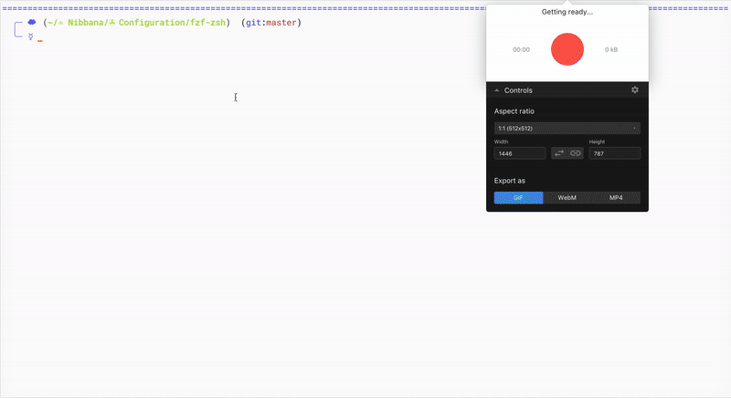
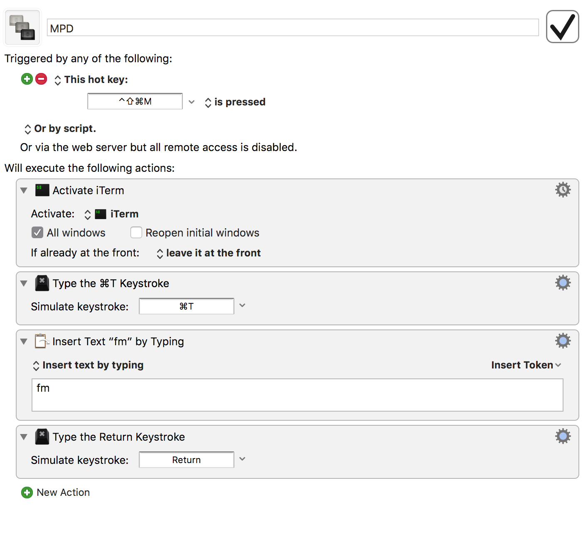

# Introduction

`fzf-mpd` is a zsh plugin that allows you to control [mpd](https://www.musicpd.org/) using [fzf](https://github.com/junegunn/fzf) an awesome command-line fuzzy finder.

## Demo

<!-- [](https://asciinema.org/a/FpQd0sZuOXTOB5c2fdanFvsVL) -->


## Requirements

- [zsh](http://www.zsh.org/)
- [mpc](https://musicpd.org/clients/mpc/)

## Installation

If you use [Antigen](https://github.com/zsh-users/antigen), add the following line to your .zshrc:

```
antigen bundle piotryordanov/fzf-mpd
antigen apply
```

Otherwise, copy the [fzf-mpd script](https://raw.githubusercontent.com/piotryordanov/fzf-mpd/master/fzf-mpd.zsh) into your zsh.after director


## Usage

`> fm`

## Global Launch (Mac only)

On Mac, you can launch `fm` from anywhere by running a keybinding. You'll need [Keyboard maestro](http://www.keyboardmaestro.com/main/)  or a similar software to do something like this: 




